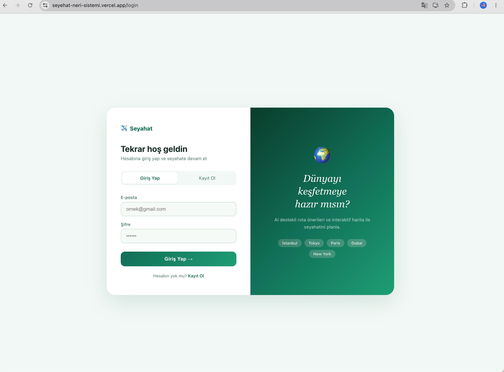
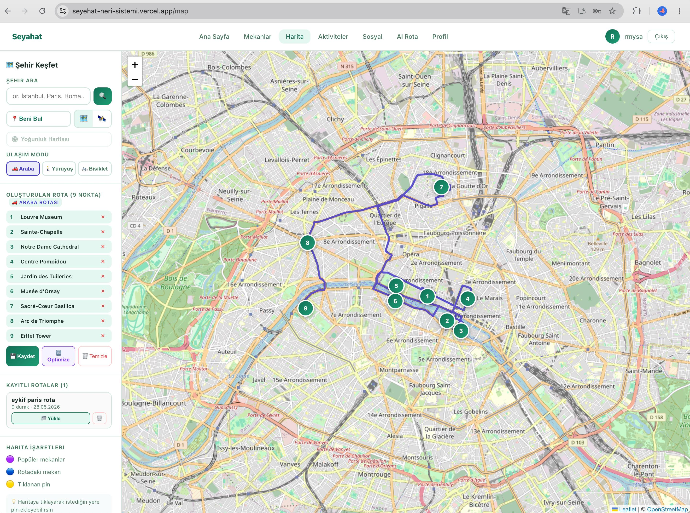
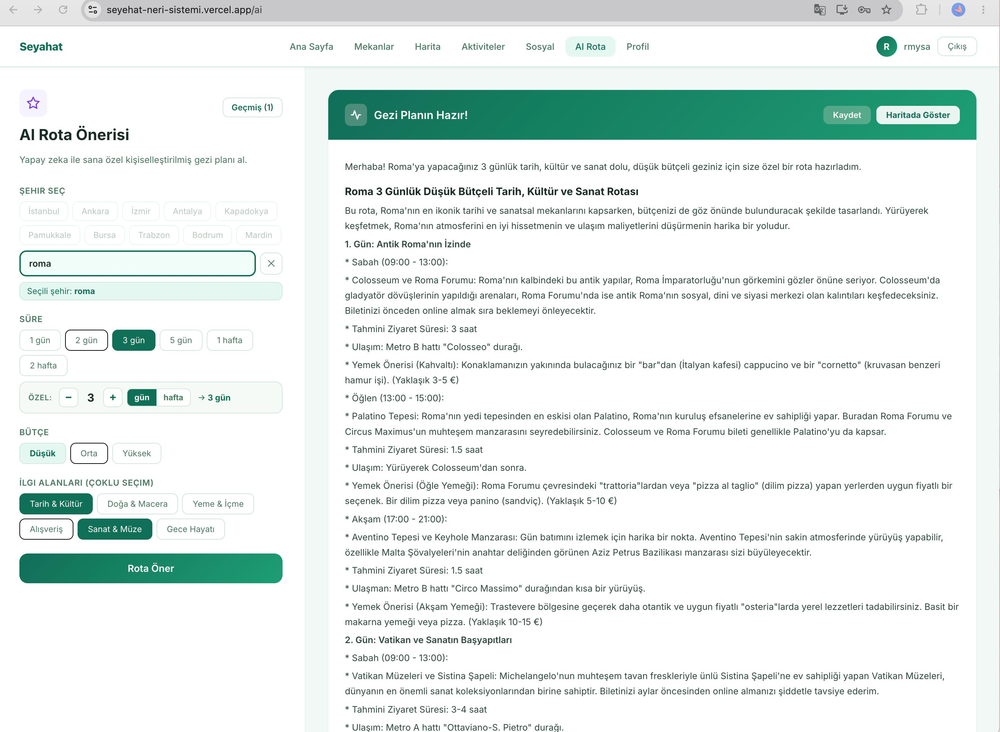

<div align="center">

# Seyahat Öneri Sistemi

**Yapay zeka destekli, tam yığın seyahat planlama uygulaması**

Mekanları keşfet · AI ile rota al · Haritada görselleştir · Arkadaşlarınla paylaş

[](https://github.com/RumeysaAkbulut/travel-recommendation-system/actions)
[](https://python.org)
[](https://flask.palletsprojects.com)
[](https://react.dev)
[](LICENSE)

**[🌐 Canlı Demo](https://seyehat-neri-sistemi.vercel.app)** · **[📡 API](https://seyahat-oneri-backend-production-5d8f.up.railway.app)** · **[📋 Jira](https://your-jira-link)**

</div>

---

##  Ekran Görüntüleri

| Dashboard | Harita & Rota | AI Öneri |
|---|---|---|
|  |  |  |

---

## Özellikler

| Modül | Özellikler |
|---|---|
|  **Kimlik Doğrulama** | JWT tabanlı kayıt/giriş, 7 günlük oturum, şifre hash (bcrypt) |
|  **Mekan Keşfi** | Şehir & kategori filtresi, metin arama, detay sayfası, Wikipedia entegrasyonu |
|  **İnteraktif Harita** | Leaflet harita, Overpass API POI çekme, GPS konumu, uydu/cadde görünümü |
|  **AI Rota Önerisi** | Gemini API ile şehir/süre/bütçe bazlı gezi planı, otomatik geocoding, haritada görselleştirme |
|  **Rota Yönetimi** | Haritadan tıklayarak rota oluşturma, en yakın komşu optimizasyonu, kaydetme & paylaşma |
|  **Favoriler & Koleksiyonlar** | Mekan favorileme, özel koleksiyon oluşturma ve yönetme |
|  **Yorum & Puanlama** | 1-5 yıldız puanlama, metin yorum, ortalama puan hesaplama |
|  **Sosyal Akış** | Kullanıcı takip sistemi, aktivite akışı, arkadaşların rotalarını görüntüleme |
|  **Aktivite Geçmişi** | Kişisel ve sosyal aktivite takibi |

---

##  Teknoloji Yığını

### Backend

| Teknoloji | Versiyon | Kullanım |
|---|---|---|
| Python | 3.11 | Ana dil |
| Flask | 3.x | REST API çatısı |
| SQLAlchemy | 2.0 | ORM |
| Flask-Migrate | 4.x | Veritabanı migration (Alembic) |
| Flask-JWT-Extended | 4.x | JWT kimlik doğrulama |
| Google Gemini API | 1.x | AI rota önerisi |
| pytest | 9.x | Birim & entegrasyon testleri |
| Gunicorn | 23.x | Production WSGI sunucusu |

### Frontend

| Teknoloji | Versiyon | Kullanım |
|---|---|---|
| React | 18 | SPA çatısı |
| React Router | v6 | İstemci taraflı yönlendirme |
| Leaflet + React-Leaflet | — | İnteraktif harita |
| Axios | — | HTTP istekleri |
| Photon (komoot.io) | — | Geocoding |
| Nominatim (OSM) | — | Geocoding fallback |

### Altyapı & DevOps

| Bileşen | Platform |
|---|---|
| Frontend Hosting | [Vercel](https://vercel.com) (otomatik deploy) |
| Backend Hosting | [Railway](https://railway.app) |
| Veritabanı | [Neon](https://neon.tech) — Serverless PostgreSQL |
| CI/CD | GitHub Actions (lint + test + build) |
| Sürüm Kontrolü | Git + GitHub (feature branch, PR, code review) |

---

##  Mimari

Proje **Katmanlı N-Tier Mimari** + **Repository Pattern** + **Service Layer** üzerine inşa edilmiştir:

```
İstek → Controller → Service → Repository → Database
                  ↓
             Doğrulama &
             İş Kuralları
```

```
backend/
└── app/
    ├── models/         # SQLAlchemy entity'leri (User, Place, Route ...)
    ├── repositories/   # Veri erişim katmanı — tüm DB işlemleri burada
    ├── services/       # İş mantığı & doğrulama kuralları
    └── controllers/    # Flask Blueprint'leri — yalnızca HTTP yönetimi
```

Her özellik için 4 katman mevcuttur:

- **Model** → Veritabanı şeması ve ORM ilişkileri
- **Repository** → `db.session` üzerinden CRUD ve sorgular
- **Service** → İş kuralları (e-posta tekrarı, şifre uzunluğu vb.)
- **Controller** → HTTP endpoint, `@jwt_required`, JSON yanıt

---

##  Yerel Kurulum

### Gereksinimler

- Python 3.11+
- Node.js 18+
- Gemini API anahtarı → [Google AI Studio](https://aistudio.google.com/app/apikey)

### 1. Repoyu Klonla

```bash
git clone https://github.com/RumeysaAkbulut/travel-recommendation-system.git
cd travel-recommendation-system
```

### 2. Backend

```bash
cd backend
python -m venv venv
source venv/bin/activate        # Windows: venv\Scripts\activate
pip install -r requirements.txt
```

`backend/.env` dosyası oluştur:

```env
SECRET_KEY=gizli-bir-anahtar
JWT_SECRET_KEY=jwt-gizli-anahtar
GEMINI_API_KEY=YOUR_GEMINI_API_KEY
# Üretim için: DATABASE_URL=postgresql://...
```

Veritabanını başlat ve sunucuyu çalıştır:

```bash
flask db upgrade
python run.py
# → http://localhost:5001
```

### 3. Frontend

```bash
cd ../frontend
npm install
```

`frontend/.env` dosyası oluştur:

```env
REACT_APP_API_URL=http://localhost:5001
```

```bash
npm start
# → http://localhost:3000
```

---

##  Testler

```bash
cd backend
python -m pytest tests/ -v
```

| Test Dosyası | Kapsam |
|---|---|
| `test_user.py` | Kullanıcı modeli, repository, service, API endpoint'leri |
| `test_place.py` | Mekan repository, service, filtreleme, API endpoint'leri |
| `test_route.py` | Rota kaydetme ve listeleme |
| `test_review.py` | Yorum ve puanlama |
| `test_collection.py` | Koleksiyon CRUD |
| `test_friendship.py` | Takip sistemi |

---

##  API Referansı

### Auth

```
POST   /api/users/register      Kayıt ol
POST   /api/users/login         Giriş yap → JWT token
GET    /api/users/me            Profil bilgisi       [JWT]
PUT    /api/users/me            Profil güncelle      [JWT]
```

### Mekanlar

```
GET    /api/places/             Listele (city, category, search filtresi)  [JWT]
POST   /api/places/             Mekan ekle                                 [JWT]
GET    /api/places/<id>         Detay                                      [JWT]
PUT    /api/places/<id>         Güncelle                                   [JWT]
DELETE /api/places/<id>         Sil                                        [JWT]
```

### Rotalar

```
GET    /api/routes/             Kullanıcının rotaları    [JWT]
POST   /api/routes/             Rota kaydet              [JWT]
PUT    /api/routes/<id>         Güncelle                 [JWT]
DELETE /api/routes/<id>         Sil                      [JWT]
POST   /api/routes/<id>/share   Paylaşma linki üret      [JWT]
GET    /share/route/<token>     Paylaşılan rotayı gör    [Anonim]
```

### AI & Sosyal

```
POST   /api/ai/recommend              Gemini AI rota önerisi          [JWT]
GET    /api/social/feed               Sosyal akış                     [JWT]
POST   /api/social/follow/<id>        Kullanıcı takip et              [JWT]
DELETE /api/social/unfollow/<id>      Takibi bırak                    [JWT]
GET    /api/social/user/<id>/profile  Kullanıcı profili               [JWT]
```

> Tüm endpoint listesi için → [backend/app/controllers/](backend/app/controllers/)

---

##  Canlı Demo & Deploy

Uygulama ücretsiz platformlarda canlıdır:

| Bileşen | Platform | URL |
|---|---|---|
| Frontend | Vercel | https://seyehat-neri-sistemi.vercel.app |
| Backend | Railway | https://seyahat-oneri-backend-production-5d8f.up.railway.app |
| Veritabanı | Neon PostgreSQL | — |

### Ortam Değişkenleri

**Railway (Backend):**

```
SECRET_KEY          → Rastgele güvenli string
JWT_SECRET_KEY      → Rastgele güvenli string
GEMINI_API_KEY      → Google AI Studio
DATABASE_URL        → Neon connection string (postgresql://...)
FRONTEND_URL        → https://seyehat-neri-sistemi.vercel.app
```

**Vercel (Frontend):**

```
REACT_APP_API_URL   → Railway backend URL
```

### CI/CD Akışı

```
Push / Pull Request
        │
        ├─ flake8 lint
        ├─ pytest (tüm testler)
        └─ npm run build
                │
        develop branch merge
                │
        Vercel otomatik deploy 
```

---

##  Proje Yapısı

```
travel-recommendation-system/
├── .github/
│   └── workflows/
│       └── ci.yml                  # GitHub Actions CI pipeline
├── backend/
│   ├── app/
│   │   ├── __init__.py             # Flask uygulama fabrikası (create_app)
│   │   ├── models/                 # SQLAlchemy ORM modelleri
│   │   │   ├── user.py
│   │   │   ├── place.py
│   │   │   ├── route.py
│   │   │   ├── favorite.py
│   │   │   ├── review.py
│   │   │   ├── collection.py
│   │   │   └── friendship.py
│   │   ├── repositories/           # Veri erişim katmanı
│   │   │   ├── user_repository.py
│   │   │   ├── place_repository.py
│   │   │   ├── route_repository.py
│   │   │   ├── favorite_repository.py
│   │   │   ├── review_repository.py
│   │   │   ├── collection_repository.py
│   │   │   ├── friendship_repository.py
│   │   │   └── activity_repository.py
│   │   ├── services/               # İş mantığı katmanı
│   │   │   ├── user_service.py
│   │   │   ├── place_service.py
│   │   │   ├── route_service.py
│   │   │   ├── favorite_service.py
│   │   │   ├── review_service.py
│   │   │   └── collection_service.py
│   │   └── controllers/            # Flask Blueprint endpoint'leri
│   │       ├── user_controller.py
│   │       ├── place_controller.py
│   │       ├── route_controller.py
│   │       ├── favorite_controller.py
│   │       ├── review_controller.py
│   │       ├── collection_controller.py
│   │       ├── activity_controller.py
│   │       ├── friendship_controller.py
│   │       ├── ai_controller.py
│   │       └── main_controller.py
│   ├── migrations/                 # Alembic migration dosyaları
│   ├── tests/
│   │   ├── test_user.py
│   │   ├── test_place.py
│   │   ├── test_route.py
│   │   ├── test_review.py
│   │   ├── test_collection.py
│   │   └── test_friendship.py
│   ├── requirements.txt
│   ├── railway.toml                # Railway deploy konfigürasyonu
│   └── run.py
├── frontend/
│   ├── public/
│   │   ├── favicon.ico
│   │   └── manifest.json
│   └── src/
│       ├── components/
│       │   └── Navbar.js
│       ├── context/
│       │   └── AuthContext.js      # JWT global state
│       ├── pages/
│       │   ├── Dashboard.js
│       │   ├── Login.js
│       │   ├── Register.js
│       │   ├── Profile.js
│       │   ├── Places.js
│       │   ├── PlaceDetail.js
│       │   ├── MapPage.js          # Leaflet harita + rota
│       │   ├── AIRecommend.js      # Gemini AI öneri sayfası
│       │   ├── Routes.js
│       │   ├── Collections.js
│       │   ├── Social.js           # Sosyal akış & takip
│       │   ├── Activity.js
│       │   └── SharedRoute.js      # Paylaşılan rota görüntüleme
│       ├── api.js                  # Merkezi API URL konfigürasyonu
│       ├── theme.js                # Renk ve stil sabitleri
│       └── App.js
├── .gitignore
└── README.md
```

---

##  Katkı Sağlama

1. Bu repoyu fork'la
2. Yeni bir branch oluştur: `git checkout -b feature/ozellik-adi`
3. Değişikliklerini commit et: `git commit -m "feat: yeni özellik eklendi"`
4. Branch'i push'la: `git push origin feature/ozellik-adi`
5. Pull Request aç

---

##  Takım

| İsim | Rol |
|---|---|
| [Takım Üyesi 1] | Backend & Mimari |
| [Takım Üyesi 2] | Backend & Veritabanı |
| [Takım Üyesi 3] | Frontend & Test |

---

##  Lisans

Bu proje [MIT](LICENSE) lisansı ile lisanslanmıştır.
